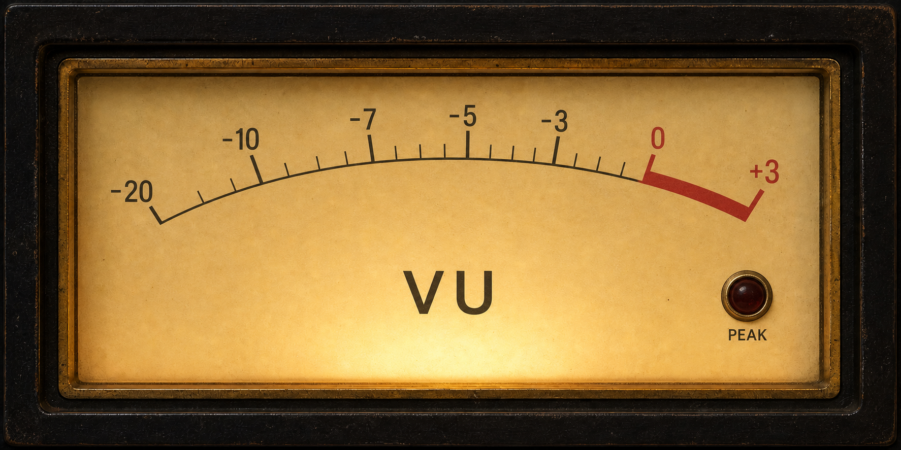

# songart

Real-time music recognition, artwork display, and live audio visualization for Raspberry Pi.

`songart` listens to ambient audio, identifies the currently playing song using SongRec (Shazam API), downloads high-resolution album artwork when available, and renders a configurable SDL-based display with artwork, metadata, and real-time audio visualizers including FFT spectrum analysis and oscilloscope rendering.

Version 0.16.0 adds application-level display rotation, a landscape side layout for rotated displays, and more reliable metadata-driven font theme changes.

---

## Features

- Real-time music recognition via SongRec
- Automatic high-resolution album artwork retrieval
- SDL-based artwork and metadata display
- Optional animated turntable artwork mode with realistic LP presentation
- Real-time FFT spectrum analyzer
- Oscilloscope audio visualizer
- Photorealistic 1970s-style dual analog VU meters
- Keyboard settings overlay with live previews and safe TOML saving
- Shared rolling audio buffer for live visualization
- Configurable display presets for portrait and landscape layouts
- Application-level SDL output rotation independent of logical layout orientation
- Landscape side layout with artwork on the right, metadata on the left, and the visualizer beneath metadata
- Improved portrait layout defaults for 1080x1920 displays
- Theme-based typography with separate title and body fonts
- Metadata-driven font theme selection by genre and release year
- Configurable font fallback behavior
- Configurable display-region backgrounds:
  - canvas background
  - artwork background
  - metadata background
  - visualizer background
- Configurable spectrum analyzer responsiveness and scaling
- Artwork-derived visualizer color palettes with fixed/fallback color support
- Human-readable timestamped logging with configurable log levels
- Externalized runtime configuration via TOML
- Graceful Ctrl+C shutdown handling
- Runtime artifacts ignored by Git

---

## 1970s Analog VU Meters



Set the visualizer independently from the artwork presentation, allowing the
analog meters and spinning turntable to appear together:

```toml
[artwork]
mode = "turntable"

[visualizer]
enabled = true
mode = "analog_vu"
```

The meter face, scale, housing, and glass treatment are cached textures. SDL
draws only the mechanical needles and peak-lamp illumination each frame.

---

## Keyboard Settings Overlay

Press `M` or `F1` while songart is running to open the settings overlay. Music
recognition, artwork animation, and the active visualizer continue behind it.
The menu always uses a dedicated sans-serif font rather than the current song
theme.

| Key | Action |
| --- | --- |
| `M` / `F1` | Open or close settings |
| `Up` / `Down` | Select artwork, visualizer, or sensitivity |
| `Left` / `Right` | Change the selected value with a live preview |
| `Enter` | Apply for the current session without saving |
| `S` | Save to `config/songart.toml` |
| `Esc` | Discard unsaved changes |

Available modes:

- Artwork: `cover`, `turntable`
- Visualizer: `spectrum`, `oscilloscope`, `analog_vu`
- Sensitivity: `0.25`–`8.0`

Saving preserves TOML comments, writes through a temporary file, and keeps the
previous configuration at `config/songart.toml.bak`.

---

## Architecture

```text
Microphone
  → rolling audio buffer
  → SongRec recognition + FFT analysis
  → Rust app state
  → artwork download
  → SDL display + metadata + visualizers
```

---

## Project Structure

```text
songart/
├── assets/
│   └── fonts/              # Custom font assets
├── config/
│   └── songart.toml        # Runtime configuration
├── src/
│   ├── main.rs             # App bootstrap and thread startup
│   ├── config.rs           # Config structs and loader
│   ├── logging.rs          # Logging helpers and log levels
│   ├── state.rs            # Shared app/song/meter state
│   ├── audio.rs            # Audio capture and rolling audio buffer
│   ├── fft.rs              # FFT spectrum processing
│   ├── visualizer/         # Visualizer mode definitions and shared primitives
│   ├── recognition.rs      # SongRec recognition loop
│   ├── display.rs          # SDL rendering loop
│   └── renderer/           # Future rendering separation scaffold
├── Cargo.toml              # Rust dependencies and package version
├── README.md
├── CHANGELOG.md
└── LICENSE
```

---

## Requirements

### Raspberry Pi

- Raspberry Pi OS
- USB microphone or supported audio input device
- HDMI-connected display

### System packages

```bash
sudo apt update
sudo apt install -y \
  libsdl2-dev \
  libsdl2-image-dev \
  libsdl2-ttf-dev \
  pkg-config
```

### SongRec

Installed separately:

```bash
cd ~/projects/vendor/songrec
cargo build --release
```

Composer metadata is read from SongRec/Shazam metadata when available. If it is
missing and SongRec provides an ISRC, `songart` tries a MusicBrainz ISRC lookup
and uses recording/work composer, writer, or lyricist relationships as a
fallback.

---

## Configuration

Runtime configuration lives in:

```text
config/songart.toml
```

### Configuration model

- `logging` controls log level and log file behavior
- `audio` controls capture device, rolling buffer, and recognition cadence
- `paths` defines SongRec and artwork paths
- `display` selects the active display preset and frame timing
- `display.colors` controls the major display-region backgrounds
- `artwork.mode` selects the standard cover or turntable-style presentation
- `display_presets` define scene geometry and spacing
- `fonts` selects fixed or metadata-driven font behavior
- `font_themes` define title/body font paths and font sizes
- `visualizer` controls FFT, spectrum, oscilloscope, and responsiveness behavior
- `visualizer.colors` controls fixed or artwork-derived visualizer foreground colors

> [!IMPORTANT]
> Keep `audio.recognition_window_ms` at **15000 ms or longer** for reliable
> recognition of newer indie and foreign-language music. Shorter 10-second
> samples were less consistent in Raspberry Pi testing. A longer window can
> delay the first identification slightly, and `audio.buffer_seconds` must be
> long enough to contain the complete recognition window.

---

## Example Configuration

```toml
[logging]
level = "debug"
file = "/home/admin/projects/songart/songart.log"
reset_on_start = true

[audio]
device = "ps3eye_mono"
sample_wav = "/home/admin/projects/songart/sample.wav"
loop_delay_secs = 3
sample_rate = 16000
channels = 1
buffer_seconds = 20
recognition_window_ms = 15000
read_chunk_bytes = 1024

[paths]
songrec_bin = "/home/admin/projects/vendor/songrec/target/release/songrec"
artwork_file = "/home/admin/projects/songart/current.jpg"

[display]
window_title = "songart"
fullscreen = true
orientation = "portrait"
rotation = "normal"
frame_delay_ms = 16

[display.colors]
background = "#000000"
artwork_background = "#000000"
metadata_background = "#000000"
visualizer_background = "#000000"

[artwork]
mode = "cover" # cover, turntable

[display_presets.portrait]
width = 1080
height = 1920
top_panel_ratio = 0.66
panel_x = 48
panel_y = 36
title_line_spacing = 52
body_line_spacing = 38
detail_line_spacing = 44

[display_presets.landscape]
width = 1920
height = 1080
top_panel_ratio = 0.72
panel_x = 40
panel_y = 28
title_line_spacing = 46
body_line_spacing = 34
detail_line_spacing = 40

[fonts]
theme = "scripted"
mode = "metadata"
fallback_theme = "simple"

[font_themes.techy]
title = "/home/admin/projects/songart/assets/fonts/Orbitron-VariableFont_wght.ttf"
body = "/home/admin/projects/songart/assets/fonts/Orbitron-VariableFont_wght.ttf"
title_size = 36
body_size = 24

[font_themes.modern]
title = "/home/admin/projects/songart/assets/fonts/Megrim-Regular.ttf"
body = "/home/admin/projects/songart/assets/fonts/SyneMono-Regular.ttf"
title_size = 42
body_size = 24

[font_themes.scripted]
title = "/home/admin/projects/songart/assets/fonts/GloriaHallelujah-Regular.ttf"
body = "/home/admin/projects/songart/assets/fonts/GloriaHallelujah-Regular.ttf"
title_size = 34
body_size = 22

[font_themes.simple]
title = "/home/admin/projects/songart/assets/fonts/SyneMono-Regular.ttf"
body = "/home/admin/projects/songart/assets/fonts/SyneMono-Regular.ttf"
title_size = 32
body_size = 22

[visualizer]
enabled = true
mode = "spectrum"
height = 300
padding = 16
peak_hold = false

window_ms = 120
point_count = 180
gain = 1.0
y_scale = 1.0
left_y_offset = 0.25
right_y_offset = 0.75
visible_sample_count = 384
max_gain = 8.0
debug_log_interval_ms = 10000

spectrum_bin_count = 64
spectrum_fft_size = 1024
spectrum_smoothing = 0.28
spectrum_min_hz = 60.0
spectrum_max_hz = 5000.0
spectrum_bar_gap = 2

spectrum_log_epsilon = 0.000001
spectrum_log_scale = 0.14
spectrum_log_offset = 0.62
spectrum_noise_floor = 0.26
spectrum_contrast = 1.45
spectrum_attack = 0.18

[visualizer.colors]
mode = "artwork"
upper = "#50DC78"
lower = "#50A0FF"
fallback_upper = "#50DC78"
fallback_lower = "#50A0FF"
min_brightness = 80
min_saturation = 0.25
palette_size = 6
hue_bucket_count = 12
```

---

## Display Configuration

### Change layout with one line

```toml
[display]
orientation = "portrait"
```

or:

```toml
[display]
orientation = "landscape"
```

The selected preset controls:

- width
- height
- top panel ratio
- metadata panel origin
- title/body/detail line spacing

`orientation` controls the logical SongArt layout. It does not rotate the physical display output.
Portrait keeps artwork in the top region with metadata and the visualizer below it. Landscape uses a side-by-side composition: metadata on the left, the visualizer underneath that metadata column, and album artwork on the right.

For best fullscreen quality, the selected preset should match the native display resolution. For example, a portrait 1080x1920 display should use:

```toml
[display_presets.portrait]
width = 1080
height = 1920
```

### Rotate the final output

Use `display.rotation` when the monitor is mounted physically rotated and you want SongArt to rotate the composed SDL frame itself:

```toml
[display]
orientation = "portrait"
rotation = "clockwise"
```

Supported canonical values:

- `normal`
- `clockwise`
- `inverted`
- `counter_clockwise`

Friendly aliases are also accepted: `0`, `90`, `180`, `270`, `right`, `left`, and `upside_down`. Missing values default to `normal`.

For 90-degree and 270-degree rotations, SongArt swaps the requested physical window dimensions while keeping the selected display preset as the logical scene size. In fullscreen desktop mode, the rotated frame is centered and scaled to the actual SDL output without clipping.

The F1 settings overlay can select and save output rotation. Restart SongArt after saving orientation or rotation changes so startup window sizing and fullscreen placement use the new value.

### Configure region backgrounds

```toml
[display.colors]
background = "#000000"
artwork_background = "#000000"
metadata_background = "#000000"
visualizer_background = "#000000"
```

Using the same color for all four values creates a seamless display. Different values can be used later for themed panel layouts.

---

## Font Themes

### Fixed font theme

```toml
[fonts]
theme = "retro"
mode = "fixed"
fallback_theme = "simple"
```

### Metadata-driven font theme

```toml
[fonts]
theme = "scripted"
mode = "metadata"
fallback_theme = "simple"
```

In metadata mode, `songart` chooses a font theme based on song genre first, then release year when genre is unknown or does not match a rule. Current built-in behavior includes:

- electronic, synth, synth-pop, new wave, dance -> `techy`
- rock, alternative, grunge, punk, metal, indie -> `grungy`
- classical, soundtrack, score, orchestral -> `fantasy`
- folk, acoustic, country, singer-songwriter, latin, spanish, mexicano, salsa, bachata, reggaeton -> `scripted`
- jazz, blues, soul, funk, disco, oldies -> `retro`
- pop, R&B, hip-hop, rap, urban -> `modern`
- unmatched pre-1980 releases -> `retro`
- unmatched 1980s releases -> `techy`
- unmatched 1990s releases -> `grungy`
- unmatched 2000+ releases -> `modern`
- unknown or unmatched metadata -> `fallback_theme`

On each track change, the display logs the font mode, genre, release value, selected theme, and currently loaded theme. When the selected theme changes, title and body fonts are reloaded before rebuilding the now-playing text cache. The keyboard settings overlay always uses its dedicated fixed font.

The bundled presets intentionally use visibly different title fonts so changes are easy to confirm on the display.

If `fonts.mode` contains an invalid value, `songart` logs a warning and uses metadata-driven selection instead of silently pinning the display to the fixed theme.

Available theme names can include:

- `modern`
- `simple`
- `retro`
- `techy`
- `grungy`
- `fantasy`
- `scripted`

Each theme controls:

- title font path
- body font path
- title font size
- body font size

---

## Visualizer Settings

```toml
[visualizer]
enabled = true
mode = "spectrum" # spectrum, oscilloscope, analog_vu
height = 300
padding = 16

window_ms = 120
point_count = 180
visible_sample_count = 384
left_y_offset = 0.25
right_y_offset = 0.75
y_scale = 1.0
spectrum_fft_size = 1024
spectrum_bin_count = 64
spectrum_min_hz = 60.0
spectrum_max_hz = 5000.0
spectrum_bar_gap = 2
spectrum_attack = 0.18
spectrum_smoothing = 0.28
spectrum_noise_floor = 0.26
spectrum_contrast = 1.45
gain = 1.0
max_gain = 8.0

[visualizer.spectrum]
render_style = "full"        # full, top_only, segmented
top_only_height_ratio = 0.35 # visible portion of each active bar in top_only mode
segment_rows = 24            # stacked LED rows in segmented mode
segment_height = 3           # pixel thickness of each segmented row
segment_gap = 2              # pixels between segmented rows
segment_column_gap = 8       # pixels between segmented columns
segment_inactive = false     # draw dim unlit rows behind active rows
segment_inactive_alpha = 36  # dim inactive LED row opacity

[visualizer.peaks]
enabled = false
hold_ms = 100
drop_pixels = 1
color = "#FFFFFF"
use_bar_color = true

[visualizer.colors]
mode = "artwork"
upper = "#50DC78"
lower = "#50A0FF"
fallback_upper = "#50DC78"
fallback_lower = "#50A0FF"
min_brightness = 80
min_saturation = 0.25
palette_size = 6
hue_bucket_count = 12
```

Set `render_style = "full"` or `render_style = "top_only"` to use the non-segmented Spectrum styles.

Set `mode = "oscilloscope"` to render the live oscilloscope view. `point_count`,
`visible_sample_count`, `left_y_offset`, `right_y_offset`, `gain`, `max_gain`,
and `y_scale` tune its trace density, time window, placement, and amplitude.

Current implementation:

- FFT spectrum analyzer
- Polished oscilloscope rendering with graticule grid and layered live traces
- Artwork-derived visualizer palettes
- Fixed and fallback visualizer colors
- Log-spaced frequency bins
- Spectrum smoothing
- Spectrum attack tuning
- Mirrored full-spectrum, full-height top-only, or segmented LED-style spectrum rendering
- Optional peak hold/drop-off markers
- Noise floor and contrast controls
- Shared rolling audio analysis buffer
- Configurable gain and FFT sizing

---

## Running

### Build

```bash
cd ~/projects/songart
cargo build --release
```

### Run from the Raspberry Pi GUI terminal

```bash
cd ~/projects/songart
./target/release/songart
```

### Or run directly with Cargo

```bash
cd ~/projects/songart
cargo run --release
```

### Test SongRec manually

```bash
~/projects/vendor/songrec/target/release/songrec recognize \
  -d "<your-audio-device>" \
  --json
```

---

## Display Behavior

`songart` renders a configured scene and scales it to fit the actual SDL canvas.

Important notes:

- The selected preset defines the intended scene size and layout.
- The actual OS / SDL canvas may still differ depending on the active desktop or display backend.
- Portrait mode behaves best when the Pi desktop session itself is already rotated to portrait.
- Running from the Pi GUI session is currently the most reliable path.
- Matching the preset resolution to the actual display resolution prevents fullscreen scaling artifacts.
- Long metadata values stay clipped to their own field widths while labels remain fixed; overflowing title, artist, album, year, genre, and composer values pause at the beginning, scroll left in a continuous loop, and pause again when the value returns to the starting position.

---

## Logging

Logging is controlled in `config/songart.toml`.

Supported levels:

- `error`
- `info`
- `debug`

Logs use human-readable local timestamps, for example:

```text
[2026-05-08 17:12:15] [Info] Listening...
```

View logs live:

```bash
tail -f /home/admin/projects/songart/songart.log
```

---

## Versioning

This project is now at **0.16.0**.

Recommended release flow:

```bash
git checkout main
git pull origin main
git tag -a v0.16.0 -m "songart 0.16.0"
git push origin v0.16.0
```

---

## Current Status

- Song recognition working
- JSON parsing working
- High-resolution artwork candidate selection working
- TOML-based runtime configuration working
- Modular source layout working
- Theme-based font selection working
- Metadata-driven font theme selection working
- Configurable display backgrounds working
- Display presets for portrait and landscape working
- Scene scaling to real SDL canvas working
- Native 1080x1920 portrait layout working
- FFT spectrum analyzer working
- Larger and more responsive spectrum visualizer working
- Artwork-derived visualizer color palettes working
- Oscilloscope visualizer working
- Photorealistic analog VU visualizer working
- Keyboard settings overlay and live mode selection working
- Application-level display rotation working on Raspberry Pi
- Metadata-driven font theme switching verified on Raspberry Pi
- Shared rolling audio analysis working
- Renderer scene caching working
- Metadata refresh improvements working
- Human-readable timestamped logging with configurable log levels working
- Graceful Ctrl+C shutdown working

---

## Future Improvements

- Additional artwork palette tuning options
- Kiosk-selectable display and artwork modes
- Further font-theme refinement
- Artwork caching and reload optimization
- More display presets and layout themes
- Metadata enrichment from additional sources
- Boot-time auto start / service mode
- Theme-based color palettes
- GPU-rendered visual effects

---

## Author

sansoo1972 (`sansoo1972`)

---

## License

This project is licensed under the [MIT License](LICENSE).
